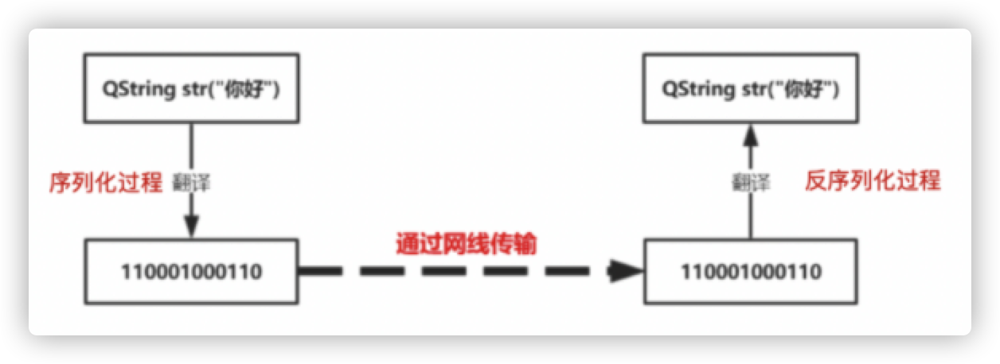

# pickle模块

## pickle简介：
- pickle是python语言的一个标准模块，安装python后已包含pickle库，不需要单独再安装。
- pickle模块实现了基本的数据序列化和反序列化。
    - 通过pickle模块的序列化操作我们能够将程序中运行的对象信息保存到文件中去，永久存储；
    - 通过pickle模块的反序列化操作，我们能够从文件中创建上一次程序保存的对象。 

> 序列化过程将文本信息转变为二进制数据流。这样就信息就容易存储在硬盘之中，当需要读取文件的时候，从硬盘中读取数据，然后再将其反序列化便可以得到原始的数据。

- 序列化和反序列化图示：


## pickle 和 json 的区别
- pickle 和 json 都提供了序列化（dump, dumps）,反序列化（load, loads）四个方法
- json：用于字符串和Python数据类型间进行转换,只能支持int\str\list\tuple\dict
- pickle: 用于python的数据类型间进行转换
- json是可以在不同语言之间交换数据的，而pickle只在python之间使用。
- json只能序列化最基本的数据类型，而pickle可以序列化所有的数据类型，包括类，函数都可以序列化。

## pickle中dump和load的使用
- dump()
```python
# 序列化对象，并将结果数据流写入到文件对象中。
pickle.dump(obj, file, protocol=None,*,fix_imports=True) 
# 参数说明：
    参数obj表示将要封装的对象
    参数file表示obj要写入的文件对象，file必须以二进制可写模式打开，即“wb”
    参数protocol是序列化模式，默认值为0，表示以文本的形式序列化。
# demo
# dump 将数据通过特殊的形式转换为只有python语言认识的字符串，并写入文件
with open('D:/tmp.pk', 'w') as f:
    pickle.dump(data, f)
```

- load()
```python
 # 反序列化对象。将文件中的数据解析为一个Python对象。
pickle.load(file, *,fix_imports=True, encoding=”ASCII”. errors=”strict”)
# 参数说明：
    参数file表示obj要写入的文件对象，file必须以二进制可写模式打开，即“wb”
# demo    
with open('D:/tmp.pk', 'r') as f:
    data = pickle.load(f)
```

## pickle中dumps和loads的使用
- dumps()
```python
# 此方法不需要写入文件中，它是直接返回一个序列化的bytes对象。
pickle.dumps(obj, protocol=None,*,fix_imports=True)
# demo
import pickle
data = ['aa', 'bb', 'cc']  
# dumps 将数据通过特殊的形式转换为只有python语言认识的字符串
p_str = pickle.dumps(data)
print(p_str)            
b'\x80\x03]q\x00(X\x02\x00\x00\x00aaq\x01X\x02\x00\x00\x00bbq\x02X\x02\x00\x00\x00ccq\x03e.
```

- loads()
```python
# 此方法是直接从bytes对象中读取序列化的信息，而非从文件中读取。
pickle.loads(bytes_object, *,fix_imports=True, encoding=”ASCII”. errors=”strict”)
# demo
mes = pickle.loads(p_str)
print(mes)
['aa', 'bb', 'cc']
```

## dumps/loads和dump/load的区别
- dumps/loads不需要从文件中读取，
- dump/load从文件中读取

## pickle异常模块
pickle模块可能出现三种异常：
1. PickleError：封装和拆封时出现的异常类，继承自Exception
2. PicklingError: 遇到不可封装的对象时出现的异常，继承自PickleError
3. UnPicklingError: 拆封对象过程中出现的异常，继承自PickleError

## 注意：
- pickle 只能在python中用python文件间序列化，实现了两个python 内存数据的交互（可序列化任何对象（类，列表）） 
- json 在任何软件间可以在内存数据之间的交互，只能序列化常规的对象（列表 ，字典等）